# 1. fiddler简介

抓包原理：像检查站一样检查过往的流量

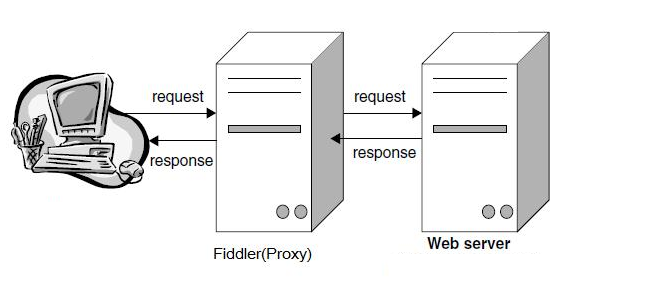

# 2. fiddler安装

下载地址：https://www.telerik.com/fiddler/fiddler-classic （已提供安装包）

默认安装即可

# 3. fiddler设置

1. 打开抓包

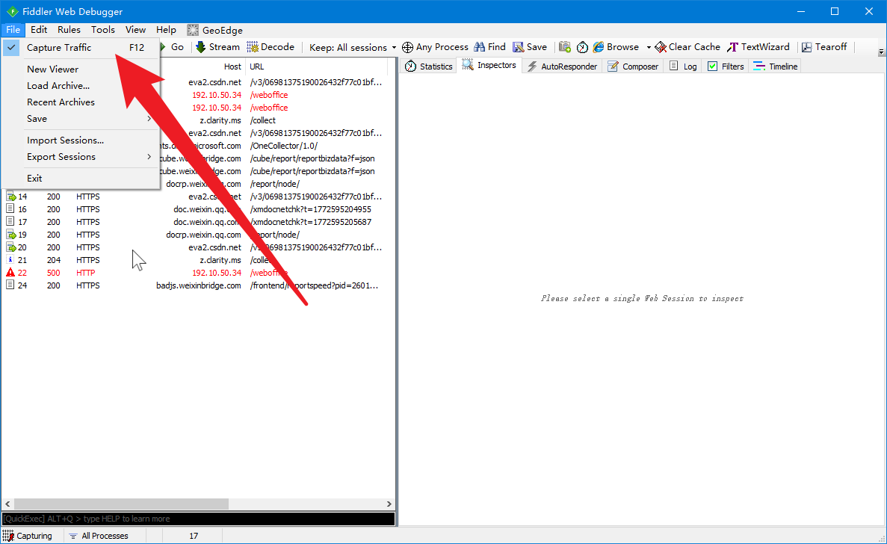

2. 打开https包解析及安装数字证书

首次勾选“Decrypt HTTPS traffic”时，会弹窗提示安装数字证书，默认点 “yes”或者“是”即可

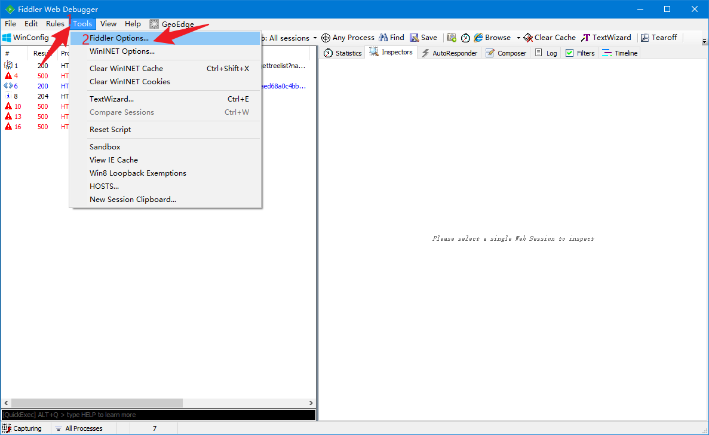

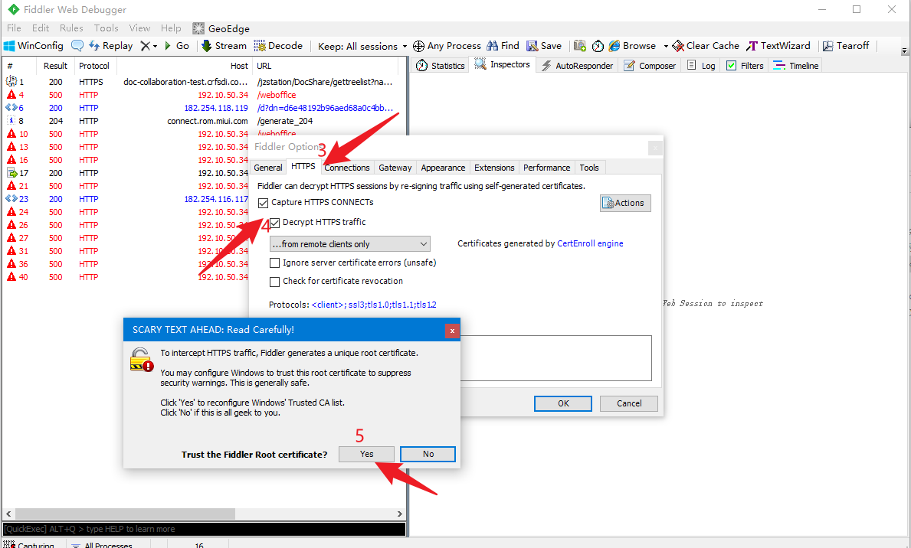

3. 设置允许远程连接

勾选“Allow remote computers connect”


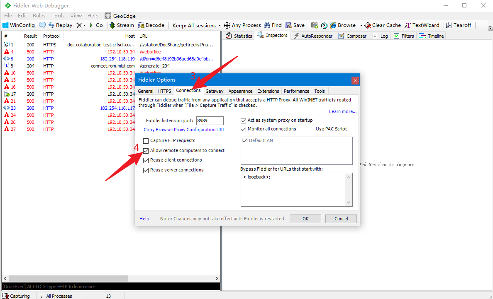

4. 设置仅抓取手机的包

选择“fromremote client only”


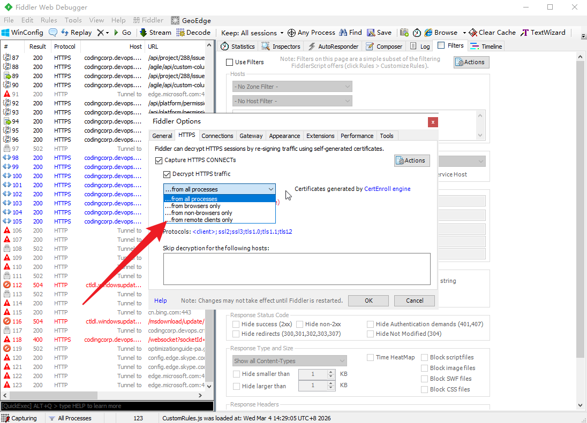

# 4. 手机设置

1. 连接电脑热点并连接
2. 打开电脑任务管理器，查看电脑热点IP

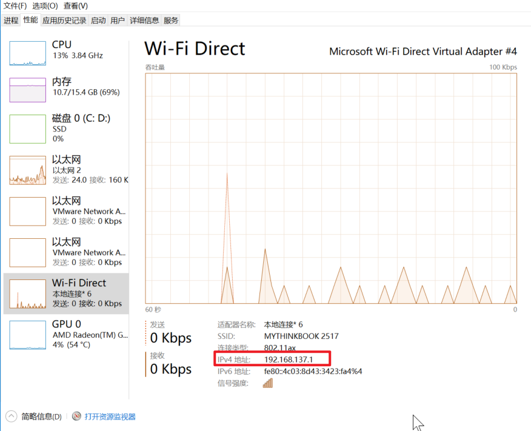

3. 查看fiddler监听端口

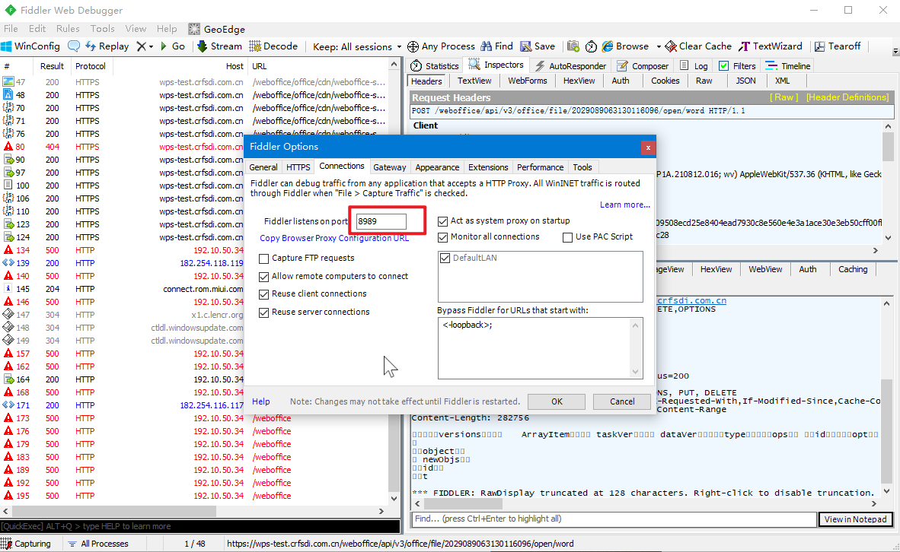

4. 修改热点

代理调为手动，主机名填写热点IP，端口号填写Fiddler监听的端口

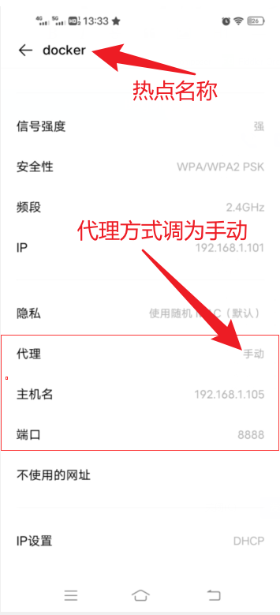

5. 在手机浏览器中输入 IP:端口号，下载fiddler证书

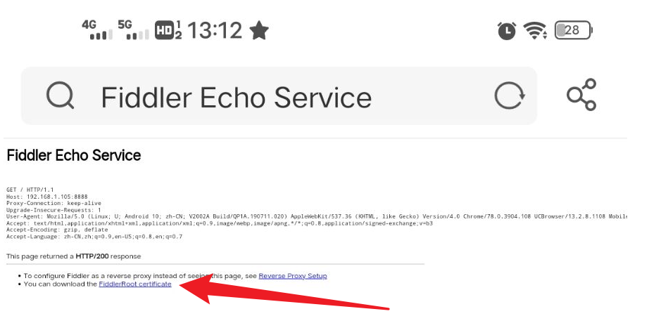

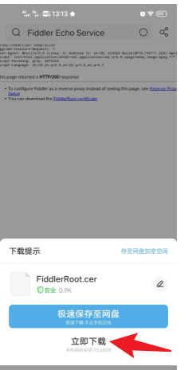

6. 在设置中搜索“证书”，找到对应的证书“FiddlerRoot”并安装（可能不同手机安装方式不一样，**建议网上搜索一下本机的证书安装方式**）

    

    安装完成的效果

    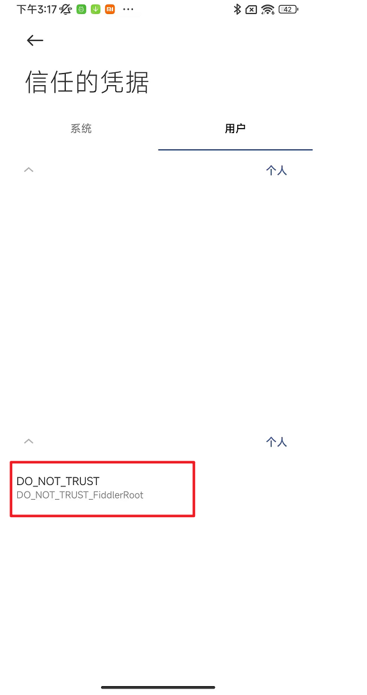

# 5. 设置过滤（非必须）

只筛选自己想看到的内容

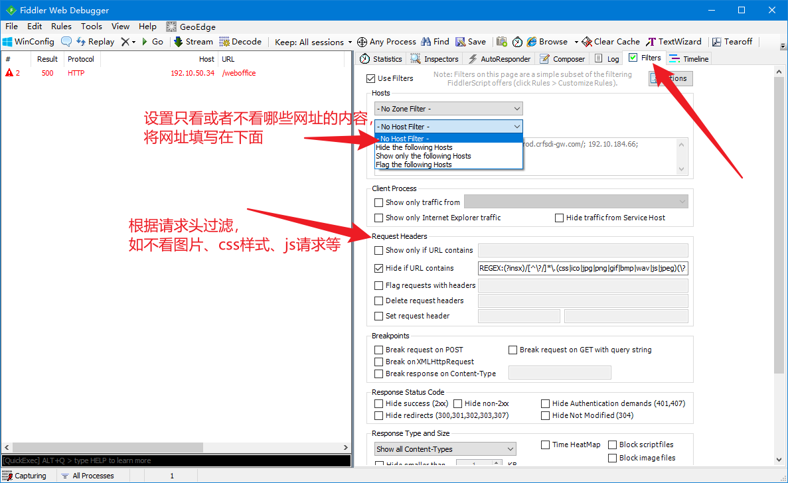

请求头过滤参考：

```
REGEX:(?insx)/[^\?/]*\.(css|ico|jpg|png|gif|bmp|wav|js|jpeg)(\?.*)?$
```

