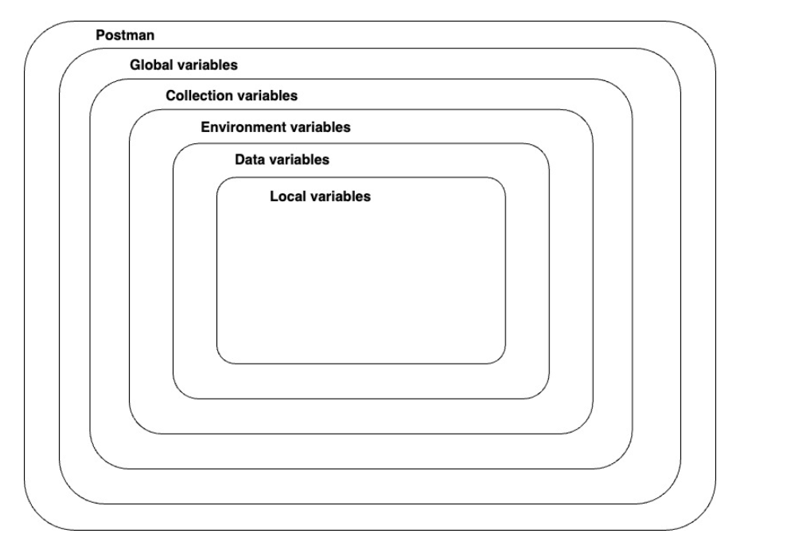
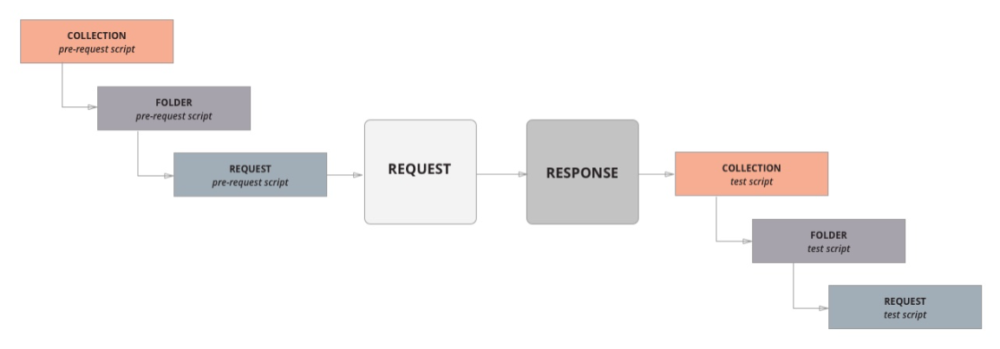

## 变量作用范围

作用范围由大到小：global > collection > environment > data > local

其中 data变量来自于运行集合时的csv文件或json文件中定义的变量

参考：https://learning.postman.com/docs/sending-requests/variables/#variables-quick-start

## 在脚本中定义变量

| Method                   | Use-case                                                     | Example                                                      |
| ------------------------ | ------------------------------------------------------------ | ------------------------------------------------------------ |
| `pm.globals`             | Use to define a global variable.                             | `pm.globals.set("variable_key", "variable_value");`          |
| `pm.collectionVariables` | Use to define a collection variable.                         | `pm.collectionVariables.set("variable_key", "variable_value");` |
| `pm.environment`         | Use to define an environment variable in the currently selected environment. | `pm.environment.set("variable_key", "variable_value");`      |
| `pm.variables`           | Use to define a local variable.                              | `pm.variables.set("variable_key", "variable_value");`        |
| `unset`                  | You can use `unset` to remove a variable.                    | `pm.environment.unset("variable_key");`                      |

## 使用文件中的变量

| 方法               | 说明                                | 举例                           |
| ------------------ | ----------------------------------- | ------------------------------ |
| `pm.iterationData` | 使用来自于文件（csv，json）中的变量 | `pm.iterationData.get("name")` |

## 脚本执行顺序

## 脚本编写参考

测试断言方法：https://learning.postman.com/docs/writing-scripts/script-references/test-examples/

动态变量：https://learning.postman.com/docs/writing-scripts/script-references/variables-list/

JS脚本：https://learning.postman.com/docs/writing-scripts/script-references/postman-sandbox-api-reference/

postman内置库：https://learning.postman.com/docs/writing-scripts/script-references/postman-sandbox-api-reference/#using-external-libraries

## 内置postman对象

- 变量
    - 环境变量: `pm.environment`
    - 集合变量: `pm.collectionVariables`
    - 全局变量: `pm.globals`
    - 文件数据变量: `pm.iterationData`
- 请求和响应数据变量
    - 请求: `pm.request`
    - 响应: `pm.response`
    - 请求信息: `pm.info`
    - cookie: `pm.cookies`
- 测试: `pm.test`
- 断言: `pm.expect`